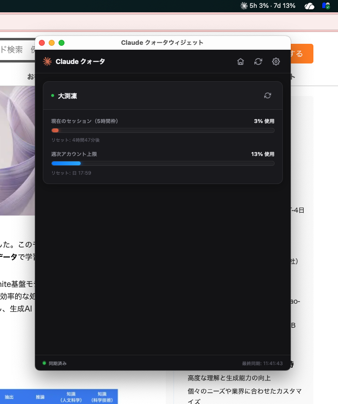

# Claude クォータウィジェット

**Tauri 2.0 + Svelte** で構築された、軽量でモダンなウィジェットアプリ。
macOS メニューバー / Windows システムトレイに常駐し、Anthropic **Claude.ai** アカウントのローリング5時間セッション制限と週間利用クォータをリアルタイムで監視できます。


> **[オリジナル](https://github.com/aminurislamarnob/claude-quota-widget)のプロジェクトとの違い**
> 
> オリジナルのClaude Quota Widgetは、Electronで構築され、Node.jsで動作するソフトウェアであり、macOSのみの対応でした。  
> このフォークされたプロジェクトは、Rust (Tauri 2.0) バックエンドとSvelteフロントエンドでリライトされており、ランタイムにはBunを使っています。
> そのため、より小さく、より高速な実行が可能であり、またWindows / macOSのクロスプラットフォームにも対応しています。

---

## 主な機能

- **Mac メニューバーウィジェット:** 5時間セッション制限と週間利用クォータの進捗率をテキストで表示するウィジェットがメニューバーに常駐。左クリックで管理画面ウィンドウの表示をトグル、右クリックで表示 / 非表示 / 終了メニュー。Dock アイコンがウィンドウの表示・非表示に同期。
- **Windows システムトレイウィジェット** 5時間セッション制限の進捗率を示すインジケーターがシステムトレイに常駐。マウスオーバーで5時間制限と週間利用クォータの進捗率をツールチップに表示。左クリックで管理画面ウィンドウの表示をトグル、右クリックで表示 / 非表示 / 終了メニュー。タスクバーアイコンがウィンドウの表示・非表示に同期。
- **言語対応:** システム言語（日本語 / 英語）に自動対応し、設定から手動で言語を切り替え可能。選択は保存されます。今後ほかの言語にも対応化させることが可能です。
- **マルチアカウント対応:** 複数の Claude アカウント（例：*個人*、*仕事*、*企業*）をカスタムラベルで追加・管理。
- **インライン編集:** ラベルの更新や期限切れ `sessionKey` のローテーションを設定リストから直接実行。キーを変更すると自動的にアカウント検証が行われます。
- **自動更新間隔設定:** バックグラウンド同期間隔を選択可能（1/5/10/15/30/60 分）。ウィジェットを開いた時と Claude CLI データの変更時は即座に更新。
- **利用アラート:** 5時間セッションが指定した閾値（50% ～ 95%）に達すると、ネイティブ通知を送信。アラートはオフにも設定可。各アカウントはセッションごとに 1 回アラートし、セッションリセット後に再度有効化。
- **ライブシンク & アカウント隔離:** Rust バックエンドが Anthropic のプライベート Web エンドポイントに直接通信（ブラウザ CORS 制限なし）。アカウントは並列で取得され、期限切れ / 失敗したキーは他のアカウントに影響を与えずに隔離。
- **プライバシー第一:** セッションキーは `~/.claude/tracker-settings.json` にローカル保存され、Claude.ai にのみ送信されます。

---

## アプリインターフェース プレビュー



---

## `sessionKey` の取得方法

ライブ利用状況メトリクスを同期するには、各アカウントの `sessionKey` クッキー値が必要です：

1. ブラウザを開き [claude.ai](https://claude.ai) にログイン。
2. ページ上で右クリックして **検査**（または **Inspect**）を選択し、開発者ツールを開く。
3. **Application**（Chrome / Safari）または **Storage**（Firefox）タブに移動。
4. 左サイドバーの **Cookies** を展開し、`https://claude.ai` をクリック。
5. `sessionKey` という行を見つけ、値全体をコピー（`sk-ant-sid02-...` で始まります）。
6. ウィジェットヘッダの歯車アイコン `[⚙]` をクリック、ラベル（例：*個人*）を入力、キーを貼り付け、**Add Account**（アカウント追加）をクリック。

> **キーが期限切れ？**  
> `sessionKey` クッキーは Anthropic によって定期的にローテーションされます。
> アカウントが *Sync Failed*（同期失敗）警告を表示する場合、設定を開き、そのアカウントの **Edit**（編集）をクリックして新しいキーを貼り付けてください。

---

## インストール & セットアップ

### 最も簡単な方法：リリース版をダウンロード

GitHub の [最新リリース](https://github.com/rinfromniigata/claude-quota-widget/releases) から、あなたのシステムに合わせたアプリをダウンロードしてください：

- **macOS (Apple Silicon + Intel Universal):** `Claude.Quota.Widget_*.dmg`
- **Windows (x64):** `Claude.Quota.Widget_*.exe`

`.dmg` をダウンロードしたら、ファイルをダブルクリック → Applications フォルダにドラッグ &ドロップ。
`.exe` をダウンロードしたら、インストーラーを実行してインストール完了。

> **初回起動時/インストール時に警告が表示される?**  
> プラットフォーマーが提供する有効な証明書無しでビルドしているため、macOS Gatekeeper または Windows Defender SmartScreen が検証警告を表示します。  
> macOSで開くときは、右クリックして**開く**を選択し、その後**開く**をクリックしてください。
> Windowsにインストールするときは、警告画面の**詳細情報**をクリックし、その後**実行**をクリックしてください。

> **Windows aarch64が無い?**  
> 私の手元に検証環境が無いのでリリースしていません。
> Windows11に内蔵されたPrism互換レイヤーで動く気がしますが確認はしていません。  
> BunはWindows aarch64用バイナリをリリースしていますので、当該環境を持っている人はローカルでビルドしてください。

---

### ローカルで開発・ビルドする場合

#### 前提条件
- **[Bun](https://bun.sh)** (パッケージマネージャー + スクリプトランナー)
- **[Rust](https://rustup.rs)** (安定版ツールチェーン — Tauri で必須)
- **macOS:** Xcode Command Line Tools (`xcode-select --install`)
- Linux/Windows: [Tauri の前提条件](https://tauri.app/start/prerequisites/)を参照

#### 1. 依存関係のインストール
```bash
bun install
```

#### 2. 開発モードで実行
```bash
bun run dev
```
Vite 開発サーバーを起動し、Tauri ウィンドウを立ち上げます。モノクロバーストアイコンがステータスバーにマウントされます。ウィンドウを閉じてもアプリはメニューバーで実行継続（macOS では Dock アイコンが自動的に非表示）。

#### 3. ローカルでビルド
```bash
bun run build
```
最適化されたネイティブバンドル（`.app` と `.dmg`/`.exe`）を生成します。出力は `src-tauri/target/release/bundle/` に生成されます。

---

## ファイル構成 📂

```
claude-quota-widget/
├── index.html                   # Vite エントリーポイント（Svelte アプリをマウント）
├── package.json                 # Bun スクリプト & フロントエンド依存
├── vite.config.ts / svelte.config.js / tsconfig.json
├── src/                         # フロントエンド（Svelte + TypeScript）
│   ├── main.ts                  # アプリマウント
│   ├── App.svelte               # ルート：ダッシュボード/設定 + トレイドラッグエリア
│   ├── app.css                  # macOS グラスモーフィズムスタイル
│   ├── components/              # Header, Dashboard, AccountCard, Settings, …
│   └── lib/
│       ├── api.ts               # invoke()/listen() ラッパー（preload に代替）
│       ├── stores.ts            # accounts/settings/status ストア + アクション
│       ├── quota.ts             # スネークケース/キャメルケース正規化 + 時間フォーマット
│       ├── i18n.ts              # ロケールストア + t() 翻訳機
│       └── locales/{en,ja}.ts   # 文字列辞書
├── src-tauri/                   # Rust バックエンド
│   ├── Cargo.toml / tauri.conf.json
│   ├── capabilities/default.json
│   ├── icons/                   # アプリ + トレイテンプレートアイコン
│   └── src/
│       ├── main.rs / lib.rs     # エントリー + ビルダー配線
│       ├── commands.rs          # #[tauri::command] ハンドラー（ApiResult）
│       ├── quota.rs             # claude.ai 利用状況取得（reqwest）
│       ├── settings.rs          # tracker-settings.json I/O
│       ├── watcher.rs           # デバウンス fs watch → "data-changed"
│       ├── tray.rs              # メニューバー トレイ + メニュー
│       └── window.rs            # 表示/非表示 + macOS Dock アクティベーション ポリシー
└── README.md
```

---

## セキュリティ & プライバシー

- すべてのリクエストはローカルマシンから **直接** `claude.ai` エンドポイントに送信されます（Rust バックエンドが実行）。
- 中央サーバー、トラッキング、プロキシは使用されません。
- キーは `~/.claude/tracker-settings.json` にローカル JSON として保存されます。プレーンテキストで保存されるため、マシンのセキュリティを維持してください。
- このソフトウェアはオープンソースです。

---

## 免責事項

このプロジェクトは非公式です。
Anthropic とは提携していませんし推奨もされていません。  
Claude は Anthropic の商標です。